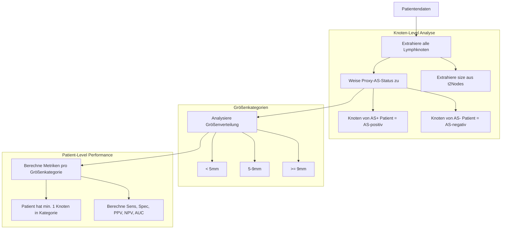

# Node Size Analysis - Revisionsplan

## Zusammenfassung der Analyse

### Problemstellung
Die aktuelle `node_size_analysis.js` implementiert eine **falsche Stratifizierungslogik**. Sie stratifiziert Patienten nach der Größe ihres **größten** Lymphknotens, was nicht den Anforderungen des Reviewers entspricht.

### Was der Reviewer fordert (Revision Letter, Punkt 3):
1. **Size distribution of evaluated nodes** - Größenverteilung aller evaluierten Lymphknoten
2. **Mean size of Avocado Sign-positive versus negative nodes** - Mittlere Größe von AS-positiven vs. -negativen Knoten
3. **Diagnostic performance stratified by node size** - Diagnostische Performance stratifiziert nach Knotengröße

### Datenlimitation
Es gibt **keine direkte Knoten-Level-Zuordnung** zwischen T2-Knoten und AS-Status. Lösung: **Proxy-Ansatz** - Knoten von AS+ Patienten werden als "AS-positiv" betrachtet.

---

## Detaillierter Implementierungsplan

### Phase 1: Node Size Analysis komplett neu implementieren

#### 1.1 Neue Klasse `NodeSizeAnalysis` mit korrekter Logik



#### 1.2 Korrekte Methoden

| Methode | Aktuell (FALSCH) | Neu (KORREKT) |
|---------|------------------|---------------|
| `getMaxNodeSize()` | Größe des größten Knotens pro Patient | Entfernen - nicht benötigt |
| `stratifyPatients()` | Nach max. Knotengröße stratifizieren | Nach Vorhandensein von Knoten in Größenkategorien stratifizieren |
| `calculateMetrics()` | Auf Patientengruppe anwenden | Beibehalten, aber mit korrekter Stratifizierung |

#### 1.3 Neue Analyse-Methoden

```javascript
// Neue Methoden für NodeSizeAnalysis

// 1. Extrahiere alle Knoten mit Proxy-AS-Status
extractAllNodesWithProxyStatus() {
    // Für jeden Patienten:
    //   Für jeden Knoten in t2Nodes:
    //     Erstelle Knoten-Objekt mit:
    //       - size
    //       - proxyAsStatus = patient.asStatus
    //       - nStatus = patient.nStatus
    //       - patientId
}

// 2. Berechne Größenverteilung
calculateSizeDistribution() {
    // Alle Knoten: mean, sd, median, min, max
    // AS+ Knoten: mean, sd, median
    // AS- Knoten: mean, sd, median
    // N+ Knoten: mean, sd, median
    // N- Knoten: mean, sd, median
}

// 3. Stratifiziere nach Größenkategorien
stratifyBySizeCategory() {
    // < 5mm: Alle Knoten mit size < 5
    // 5-9mm: Alle Knoten mit 5 <= size < 9
    // >= 9mm: Alle Knoten mit size >= 9
}

// 4. Patient-Level Performance pro Größenkategorie
calculatePerformanceBySizeCategory() {
    // Für jede Kategorie:
    //   - Identifiziere Patienten mit min. 1 Knoten in dieser Kategorie
    //   - Berechne TP, TN, FP, FN für AS vs N
    //   - Berechne Sens, Spec, PPV, NPV, AUC
}
```

---

### Phase 2: Integration mit statistics_service.js

#### 2.1 Erweitere `calculateSizeDistribution()`

Die aktuelle Implementierung in `statistics_service.js` (Zeile 828-905) hat ähnliche Probleme. Sie muss erweitert werden:

```javascript
// Aktuelle Probleme:
// - Zeile 853-855: Proxy-Zuordnung ist korrekt, aber...
// - Zeile 886-902: categoryPerformance basiert auf maxNodeSizeCategory (FALSCH)

// Korrektur:
// - Entferne maxNodeSizeCategory-basierte Performance
// - Füge korrekte Patient-Level-Performance hinzu
```

#### 2.2 Neue Ausgabe-Struktur

```javascript
{
    // Knoten-Level Statistiken
    nodeStats: {
        all: { mean, sd, median, min, max, n },
        asPositive: { mean, sd, median, min, max, n },
        asNegative: { mean, sd, median, min, max, n },
        nPositive: { mean, sd, median, min, max, n },
        nNegative: { mean, sd, median, min, max, n }
    },
    
    // Größenverteilung
    sizeDistribution: {
        small: { threshold: '<5mm', count, percentage },
        medium: { threshold: '5-9mm', count, percentage },
        large: { threshold: '>=9mm', count, percentage }
    },
    
    // Patient-Level Performance pro Kategorie
    patientPerformanceByCategory: {
        small: {
            patientCount,
            asPerformance: { sens, spec, ppv, npv, auc, tp, tn, fp, fn },
            t2Performance: { sens, spec, ppv, npv, auc, tp, tn, fp, fn }
        },
        medium: { ... },
        large: { ... }
    }
}
```

---

### Phase 3: Validierung aller Analysen

#### 3.1 ESGAR-Kriterien-Implementierung prüfen

Die ESGAR-Kriterien in `study_criteria_manager.js` sind korrekt implementiert:
- **Primary Staging**: ≥9mm OR (5-8mm AND ≥2 features) OR (<5mm AND 3 features)
- **Restaging**: ≥5mm

#### 3.2 Metriken gegen Manuskript-Werte validieren

| Metrik | Manuskript-Wert | Zu validieren |
|--------|-----------------|---------------|
| AS Overall AUC | 0.91 (0.86-0.96) | ✓ |
| AS Overall Sens | 94.6% (53/56) | ✓ |
| AS Overall Spec | 87.5% (56/64) | ✓ |
| ESGAR Overall AUC | 0.72 (0.64-0.81) | ✓ |
| ESGAR Overall Sens | 80.4% (45/56) | ✓ |
| ESGAR Overall Spec | 64.1% (41/64) | ✓ |
| Cohort-opt T2 AUC | 0.81 (0.74-0.88) | ✓ |
| Cohort-opt T2 Sens | 75.0% (42/56) | ✓ |
| Cohort-opt T2 Spec | 87.5% (56/64) | ✓ |

---

### Phase 4: UI-Integration

#### 4.1 Tabellen für die Node Size Analysis

Neue Tabelle für das Manuskript:

| Size Category | Nodes n | Mean Size mm | AS+ Mean | AS- Mean | p-value |
|---------------|---------|--------------|----------|----------|---------|
| < 5mm | ... | ... | ... | ... | ... |
| 5-9mm | ... | ... | ... | ... | ... |
| ≥ 9mm | ... | ... | ... | ... | ... |
| Overall | ... | ... | ... | ... | ... |

#### 4.2 Performance-Tabelle nach Größe

| Size Category | Patients n | AS Sens | AS Spec | AS AUC | T2 Sens | T2 Spec | T2 AUC |
|---------------|------------|---------|---------|--------|---------|---------|--------|
| < 5mm | ... | ... | ... | ... | ... | ... | ... |
| 5-9mm | ... | ... | ... | ... | ... | ... | ... |
| ≥ 9mm | ... | ... | ... | ... | ... | ... | ... |

---

## Dateien die geändert werden müssen

1. **`js/services/node_size_analysis.js`** - Komplett neu implementieren
2. **`js/services/statistics_service.js`** - `calculateSizeDistribution()` erweitern
3. **`js/ui/tabs/statistics_tab.js`** - UI für neue Analyse anpassen
4. **`js/ui/components/table_renderer.js`** - Neue Tabellen rendern

---

## Implementierungsreihenfolge

1. [ ] `node_size_analysis.js` komplett neu schreiben
2. [ ] `statistics_service.js` `calculateSizeDistribution()` erweitern
3. [ ] Validierungsfunktion implementieren
4. [ ] UI-Komponenten anpassen
5. [ ] End-to-End Test mit allen 120 Patienten
6. [ ] Metriken gegen Manuskript-Werte validieren
